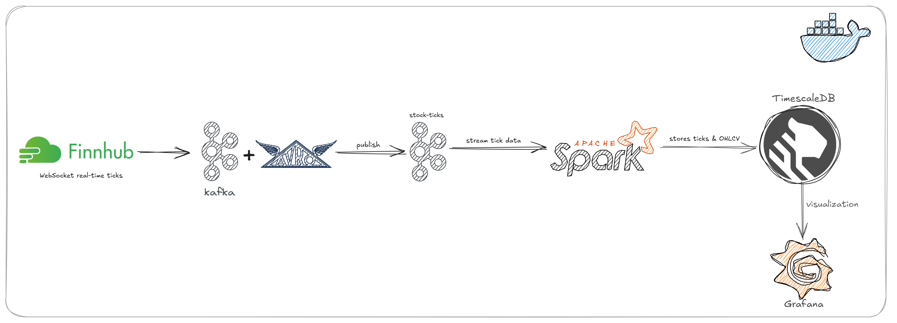

# Real-Time Stock Pipeline

A real-time stock data pipeline using Kafka, Apache Spark, TimescaleDB, and Grafana.

## Features

- **Real-time data ingestion** from Finnhub WebSocket API
- **Kafka** for message streaming
- **Avro** for efficient serialization
- **Spark Structured Streaming** for real-time ETL and OHLCV aggregation
- **TimescaleDB** for scalable time-series storage
- **Grafana** for data visualization

## Architecture Overview



## Project Structure

```bash
real-time-stock-pipeline/
├── avro_schema/           # Avro schema files
├── db/                    # Database
├── finhub_producer/       # Finnhub Kafka consumer (test)
├── config.json            # Project configuration
├── docker-compose.yml     # Docker services
├── finhub_producer/       # Finnhub Kafka producer
│   └── producer.py
├── spark/                 # Spark streaming jobs
│   ├── ohlcv_streaming.py
│   └── tick_streaming.py
├── grafana/               # Grafana provisioning
├── Makefile               # Build/run shortcuts
└── README.md
```

## Database Schema

The project uses **TimescaleDB** to store both raw tick data and aggregated OHLCV data.

### Table: `tick_data`

| Column     | Type      | Description                         |
| ---------- | --------- | ----------------------------------- |
| symbol     | TEXT      | Stock symbol (e.g. BINANCE:BTCUSDT) |
| price      | DOUBLE    | Trade price                         |
| event_time | TIMESTAMP | Event timestamp                     |
| volume     | DOUBLE    | Trade volume                        |

**Primary key:** (symbol, event_time)

---

### Table: `ohlcv_data`

| Column    | Type      | Description               |
| --------- | --------- | ------------------------- |
| timestamp | TIMESTAMP | Start of the OHLCV window |
| symbol    | TEXT      | Stock symbol              |
| open      | DOUBLE    | Open price                |
| high      | DOUBLE    | High price                |
| low       | DOUBLE    | Low price                 |
| close     | DOUBLE    | Close price               |
| volume    | DOUBLE    | Total volume              |

**Unique constraint:** (timestamp, symbol)

---

**Note:**

- The Spark jobs will automatically upsert (insert or update) OHLCV data based on `(timestamp, symbol)`.
- You can create these tables manually or let the Spark job create them if the JDBC writer is configured with `mode("append")`.

## Grafana Dashboard

| Panel Title                | Type        | Description                                                           |
| -------------------------- | ----------- | --------------------------------------------------------------------- |
| **Last Price**             | Stat        | Displays the latest tick price for the selected symbol (`tick_data`). |
| **1-Min Price Volatility** | Table       | Shows short-term price volatility calculated over the last 1 minute.  |
| **Price**                  | Time Series | Line chart of tick-by-tick price movement for a selected symbol.      |
| **OHLCV**                  | Candlestick | Candlestick chart using 1-minute OHLCV data from `ohlcv_data`.        |
| **Volume**                 | Time Series | Visualizes trade volume over time, updated per tick.                  |


## Quick Start

### 1. Clone the repository

```sh
git clone https://github.com/thuythanh04/real-time-stock-pipeline
cd real-time-stock-pipeline
```

### 2. Configure

Edit `config.json` with your Finnhub token, Kafka, and database settings:

```json
{
  "finnhub_token": "YOUR_TOKEN",
  "symbols": ["BINANCE:BTCUSDT", "IC MARKETS:1"],
  "schema_path": "avro_schema/schema.asvc",
  "kafka_bootstrap_servers": "localhost:9094",
  "kafka_topic": "stock-ticks",
  "db_url": "jdbc:postgresql://localhost:5432/stocks",
  "db_user": "yourusername",
  "db_password": "yourpassword"
}
```

### 3. Start the stack

```sh
make up
```

This will start Kafka, TimescaleDB, Spark, and Grafana using Docker Compose.

### 4. Start the Finnhub Producer

```sh
make produce
```

### 5. Initialize the Database

```sh
make init-db
```

### 6. Start Spark Streaming Jobs

In another terminal:

```sh
make ohlcv
make tick
```

### 7. Visualize in Grafana

- Access Grafana at [http://localhost:3000](http://localhost:3000)
- Default login: `admin` / `admin`
- Connect to TimescaleDB and create dashboards

## Requirements

- Python 3.8+
- Docker & Docker Compose
- Python packages: `pyspark`, `kafka-python`, `psycopg2-binary`, `avro`, `websocket-client`

Install Python dependencies:

```sh
pip install -r requirements.txt
```
